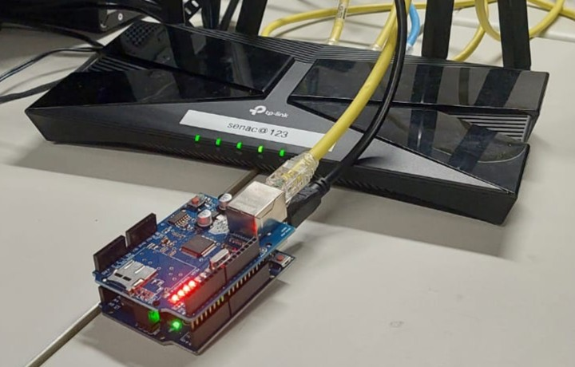
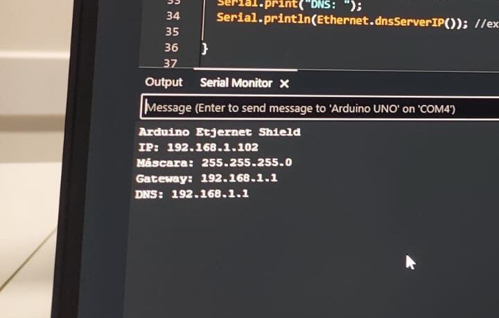
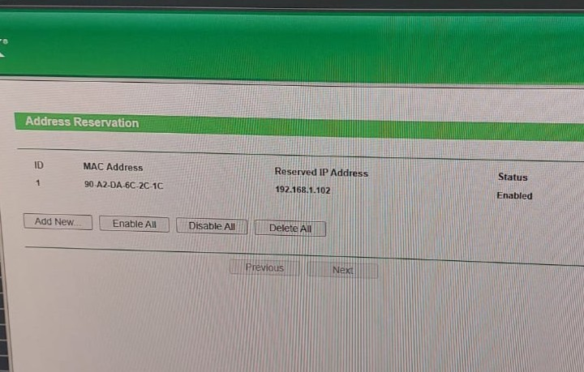

# Arduino na Rede

Nesta etapa, realizamos a integração do Arduino com a rede local utilizando um módulo Ethernet.

---

## Objetivo

Permitir que o dispositivo obtivesse um endereço IP e pudesse se comunicar na rede.

---

## Materiais Utilizados
- Arduino  
- Ethernet Shield  
- Cabo RJ45  
- Roteador  
- Celular (para testes)  
- Arduino IDE  

---

## Montagem

1. Conectar o Ethernet Shield ao Arduino  
2. Conectar o cabo RJ45 ao módulo Ethernet  
3. Conectar a outra ponta do cabo ao roteador  
4. Ligar o Arduino na energia  

---

## Configuração no Código

1. Abrir a Arduino IDE  
2. Importar a biblioteca Ethernet (já incluída na IDE)  
3. Definir um endereço MAC no código  
4. Configurar o Arduino para obter IP automaticamente (DHCP)  
5. Fazer upload do código para o Arduino  

---

## Configuração de Rede

1. Acessar o roteador  
2. Localizar o Arduino na lista de dispositivos conectados (pelo MAC Address)  
3. Reservar um IP para o dispositivo  
4. Salvar as configurações  

---

## Testes Realizados

- Verificação do endereço IP do Arduino ✓  
- Teste de conectividade utilizando **ping** ✓  
- Teste realizado via celular ✓ 

---

## Funcionamento

Após a configuração, o Arduino:

- Conectou-se à rede local  
- Recebeu um endereço IP válido  
- Passou a responder a testes de conectividade  

---

## Imagens

---

## Conclusão

Nesta etapa, foi possível integrar o Arduino à rede local com sucesso, estabelecendo comunicação básica via IP. Essa configuração é essencial para aplicações futuras em IoT e automação.
