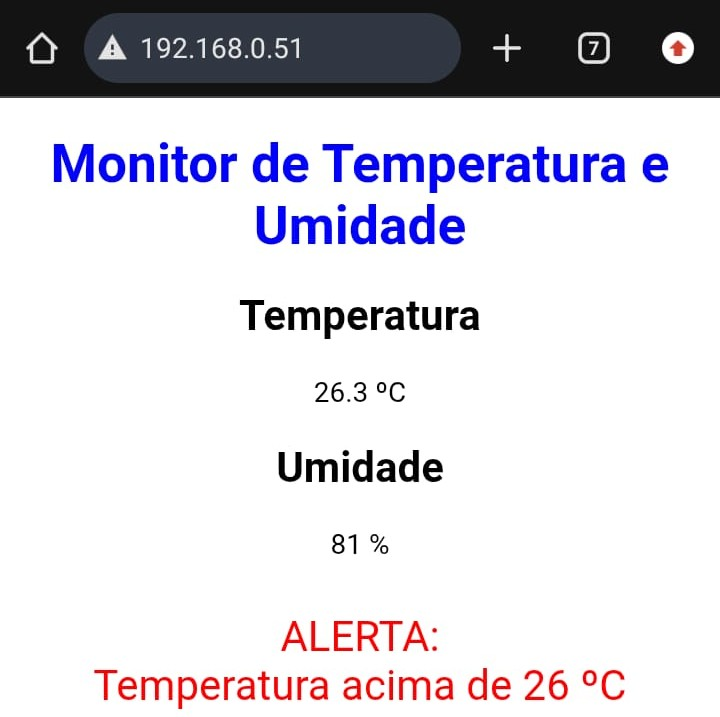

# Sensores de Temperatura e Umidade via Web

Implementamos a leitura de sensores utilizando o Arduino e exibimos os dados em uma interface web acessada via navegador. Também foi possível gerar alertas com base nos valores coletados.

---

## Objetivo
- Integrar sensores ao Arduino  
- Exibir dados em uma página web  
- Criar uma interface de monitoramento  
- Implementar alertas baseados em condições  

---

## Materiais Utilizados
- Arduino  
- Ethernet Shield  
- Cabo RJ45  
- Roteador  
- Sensor de temperatura e umidade  
- Jumpers  
- Celular (para testes)  
- Arduino IDE
- VS Code  

---

## Montagem

1. Conectar o Ethernet Shield ao Arduino  
2. Conectar o Arduino ao roteador via cabo RJ45  
3. Conectar o sensor de temperatura e umidade ao Arduino  
4. Ligar o Arduino na energia  

---

## Configuração no Código

1. Importar as bibliotecas necessárias:
   - Biblioteca do Ethernet  
   - Biblioteca do sensor  

2. Configurar o endereço MAC e IP  

3. Inicializar o sensor  

4. Criar uma página HTML para exibição dos dados  

5. Inserir o código HTML dentro do código Arduino  

6. Programar o Arduino para:
   - Ler os dados do sensor  
   - Enviar os dados via página web  
   - Exibir alertas conforme a condição definida  

7. Fazer upload do código para o Arduino  

---

## Funcionamento

- O Arduino atua como servidor web  
- O sensor coleta dados de temperatura e umidade  
- Os dados são enviados para o navegador em tempo real  
- Um alerta é exibido quando a temperatura ultrapassa 26°C  

---

## Imagens

---

## Testes Realizados

- Acesso ao sistema via celular ✓  
- Exibição da temperatura ✓  
- Exibição da umidade ✓  
- Atualização dos dados ✓  
- Alerta de temperatura funcionando ✓
