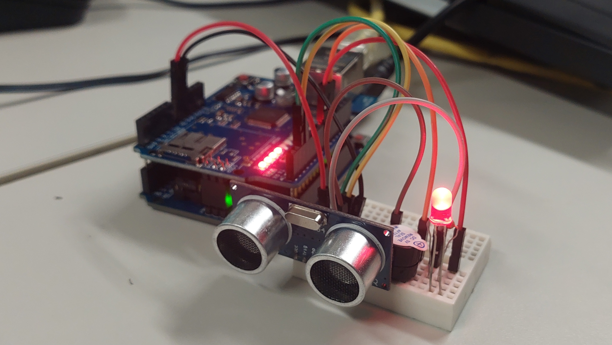

# 📡 Projeto IoT - Sensor Ultrassônico com Web App




## 👨‍🎓 Informações

**Aluno:** Reginaldo\ Anderson\ Ryan
**Disciplina:** IoT\
**Tipo:** Atividade Avaliativa

------------------------------------------------------------------------

## 🎯 Objetivo

Desenvolver um sistema IoT utilizando Arduino para leitura de distância
com sensor ultrassônico, integrado a um aplicativo web para
monitoramento em tempo real.

O sistema deve:

-   Monitorar a distância em centímetros\
-   Exibir os dados em um Web App\
-   Acionar alertas visuais e sonoros com base na distância

------------------------------------------------------------------------

## 🛠️ Tecnologias Utilizadas

-   Arduino\
-   Sensor Ultrassônico (HC-SR04)\
-   LED\
-   Buzzer\
-   Rede Wi-Fi\
-   Web App (HTTP / Interface Web)

------------------------------------------------------------------------

## 📚 Bibliotecas Utilizadas

-   Biblioteca para leitura de distância do sensor ultrassônico\
-   Biblioteca para gerenciamento de endereço MAC e conexão de rede

------------------------------------------------------------------------

## ⚙️ Funcionamento do Sistema

O Arduino realiza a leitura da distância através do sensor ultrassônico
e envia os dados via rede para um aplicativo web.

O sistema responde da seguinte forma:

-   📏 Distância normal → apenas exibição no app\
-   ⚠️ Menor que 30cm → LED acende + alerta no app\
-   🚨 Menor que 10cm → LED pisca + buzzer ativa + alerta crítico

------------------------------------------------------------------------

## 📶 Etapas do Desafio

### 🔹 Configuração da Rede

-   Conectar o Arduino à rede Wi-Fi\
-   Definir um IP fixo para o dispositivo

------------------------------------------------------------------------

### 🔹 Montagem do Circuito

Componentes utilizados:

-   Sensor Ultrassônico (HC-SR04)\
-   1 LED\
-   1 Buzzer

------------------------------------------------------------------------

### 🔹 Leitura do Sensor

-   Capturar a distância em centímetros\
-   Processar os dados do sensor

------------------------------------------------------------------------

### 🔹 Integração com Web App

-   Enviar os dados via rede\
-   Exibir em tempo real no navegador

------------------------------------------------------------------------

### 🔹 Lógica de Alertas

``` c
// ===============================
// LÓGICA DE ALERTAS DO SISTEMA
// ===============================

// A variável "distancia" armazena o valor lido pelo sensor ultrassônico (em cm)

if (distancia < 10) {

    // 🚨 ALERTA CRÍTICO
    // Situação de proximidade extrema

    // LED deve piscar para chamar atenção
    // Buzzer é ativado para emitir som de alerta
    // O Web App deve exibir um alerta crítico ao usuário

}
else if (distancia < 30) {

    // ⚠️ ALERTA MODERADO
    // Objeto próximo, mas não crítico

    // LED permanece aceso (luz fixa)
    // Buzzer não é acionado
    // O Web App exibe um aviso de atenção

}
else {

    // ✅ ESTADO NORMAL
    // Nenhum risco detectado

    // LED permanece apagado
    // Buzzer desligado
    // O Web App apenas mostra a distância normalmente

}
```

------------------------------------------------------------------------

## 🚨 Regras de Alerta

  Distância   Ação
  ----------- ----------------------------------------
  \> 30 cm    Normal
  \< 30 cm    LED ligado + alerta
  \< 10 cm    LED piscando + buzzer + alerta crítico

------------------------------------------------------------------------

## 📱 Resultado Esperado

-   Interface web exibindo distância em tempo real\
-   Alertas visuais no sistema\
-   Resposta física (LED + buzzer)

------------------------------------------------------------------------

## 📌 Conclusão

Este projeto demonstra a integração entre hardware e software no
contexto de IoT, utilizando comunicação em rede para monitoramento
remoto e tomada de decisão em tempo real.
