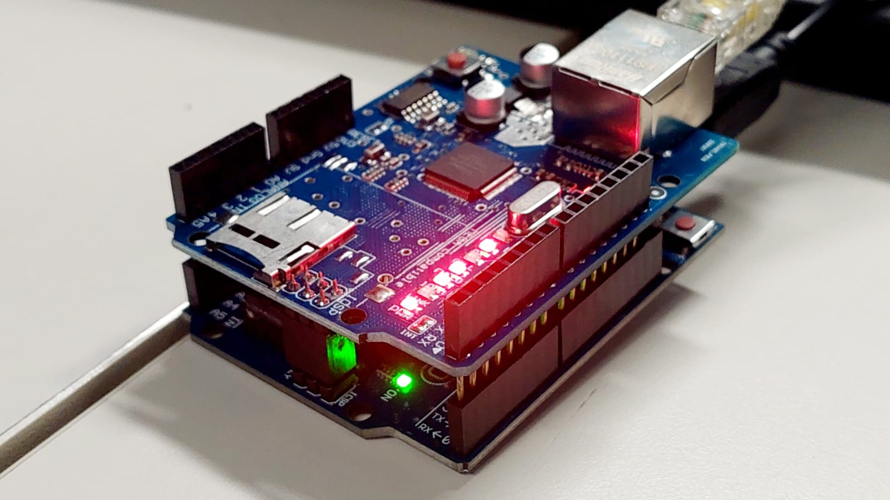

# Laboratório de Redes - Projeto Arduino com Ethernet Shield

**Unidade Curricular 5 - SENAC**

Data: 17 a ** de março de 2026  

Participantes:

- Reginaldo Tirolla Filho  
- Ryan Ferreira de Lima  
- Anderson Wilmer Yapiticona Flores  

Professor: 

- José de Assis

---

## Ilustração do Projeto

---

## Objetivo
Aplicar conceitos de IoT e automação industrial na prática, utilizando comunicação em rede.

---

## Tecnologias utilizadas
- Arduino
- Ethernet Shield
- Cabo RJ45
- Arduino IDE
- Celular (para testes)
- HTML
- Fritzing
- VS Code

---

## Testes realizados

- Ping via celular   
- Acesso via navegador   
- Carregamento da página HTML   
- Interação com botões no navegador   
- Controle de LEDs em tempo real  

---

## Resultado

Em desenvolvimento.
